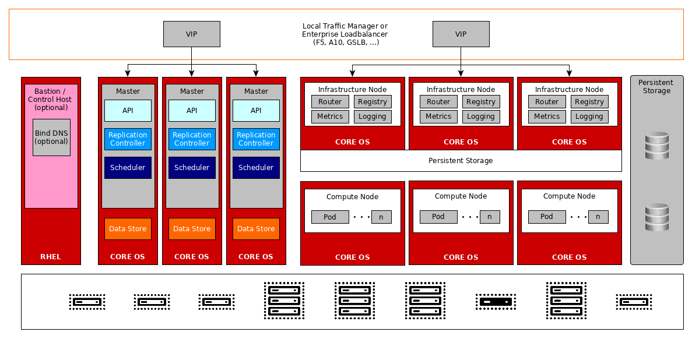

# Steps to prepare or create the environment for the proposed architecture

This setup includes configuration for Prod & UAT setup (**redprodc1**). The only change with production OpenShift setup includes configuration of 3 worker nodes & 5 infra nodes.

Other OpenShift setups in the above file are.

1. Prod DC Noida 	 cluster (**redprodc1**)

# Network Information

|Name     |IP Address Pool | Comments  |
|---------|----------------|-----------|
|Cluster Network   | 10.128.0.0/14  | Non Routable |
|Service Network   | 172.30.0.0/16  | Non Routable |
|Host Network      | 192.168.1.0/24 |  Routable    |

# Network Services

|Services     | Hosts | Comments  |
|---------|----------------|-----------|
|DNS Server    | 192.168.1.195  | Nameserver VIP for OCP nodes. |
|DHCP Server   | N/A            | Static IPs will be used for OCP nodes |
|HTTP Server   | 192.168.1.190  | Required during deployment or while adding new nodes in OCP Cluster.    |

# Load Balancer Config Details

|VIP             |    URL                        | Port        | LB IP Pool                                                 | Type                          | 
|----------------|-------------------------------|-------------|------------------------------------------------------------|-------------------------------|
|192.168.1.31   | api.ocp4.example.com    | 6443, 22623 | 192.168.1.207, 192.168.1.198, 192.168.1.199, 192.168.1.200 | Passthrough (layer 4 routing) |
|192.168.1.32   | api-int.ocp4.example.com| 6443, 22623 | 192.168.1.207, 192.168.1.198, 192.168.1.199, 192.168.1.200 | Passthrough (layer 4 routing) |
|192.168.1.33   | *.apps.ocp4.example.com | 443, 80     | 192.168.1.201, 192.168.1.198, 192.168.1.199, 192.168.1.200            | Passthrough (layer 4 routing) |

# Internet Access

The OCP v4.12. is a connected mode implementation where internet access is provided on the OpenShift cluster using an Internet. Download the require Binaries. 

- https://developers.redhat.com/content-gateway/file/pub/openshift-v4/clients/mirror-registry/1.3.10/mirror-registry.tar.gz
- https://mirror.openshift.com/pub/openshift-v4/clients/ocp/4.12.47/oc-mirror.tar.gz
- https://mirror.openshift.com/pub/openshift-v4/clients/ocp/4.12.47/openshift-client-linux-4.12.47.tar.gz
- https://mirror.openshift.com/pub/openshift-v4/clients/ocp/4.12.47/openshift-install-linux-4.12.47.tar.gz
- https://mirror.openshift.com/pub/openshift-v4/clients/pipeline/latest/tkn-linux-amd64.tar.gz
- https://mirror.openshift.com/pub/openshift-v4/dependencies/rhcos/4.12/latest/rhcos-4.12.30-x86_64-live.x86_64.iso
- https://mirror.openshift.com/pub/openshift-v4/dependencies/rhcos/4.12/latest/rhcos-4.12.30-x86_64-vmware.x86_64.ova

# Node Information

|Server FQDN           |    IP                        | Role         | Subs Used                                                  |  OS                           | 
|----------------------|------------------------------|--------------|------------------------------------------------------------|-------------------------------|
reg01.ocp4.example.com | 192.168.1.195  | Bastion | N/A | RHCOS
ha01.ocp4.example.com  | 192.168.1.196  | Haproxy | N/A | RHCOS
boot.ocp4.example.com  | 192.168.1.197  | bootstrap | N/A | RHCOS
mstr01.ocp4.example.com | 192.168.1.198 | Master | N/A | RHCOS
mstr02.ocp4.example.com | 192.168.1.199 | Master | N/A | RHCOS
mstr03.ocp4.example.com | 192.168.1.200 | Master | N/A | RHCOS

# Storage Information

| Application          | Storage Type                 | CSI Driver   | Mount Path         | Size              |
|----------------------|------------------------------|--------------|--------------------|-------------------|
| Registry             | File                         |  NFS Server  | /ocpregistry       | 500Gi             |
| Monitoring           | Block                        |  DELL CSI    | /prometheus        | 25Gi              |
| Alert Manager        | Block                        |  DELL CSI    | /alertmanager      | 25Gi              |
| Logging              | Block                        |  DELL CSI    |/elasticsearch/persistent  | 100Gi     |
| Application          | File                         |  NFS Server  | NA                 |   NA              |

# Red Hat OpenShift Container Platform 4 - Logical HA Architecture

Now, Follow the following steps.