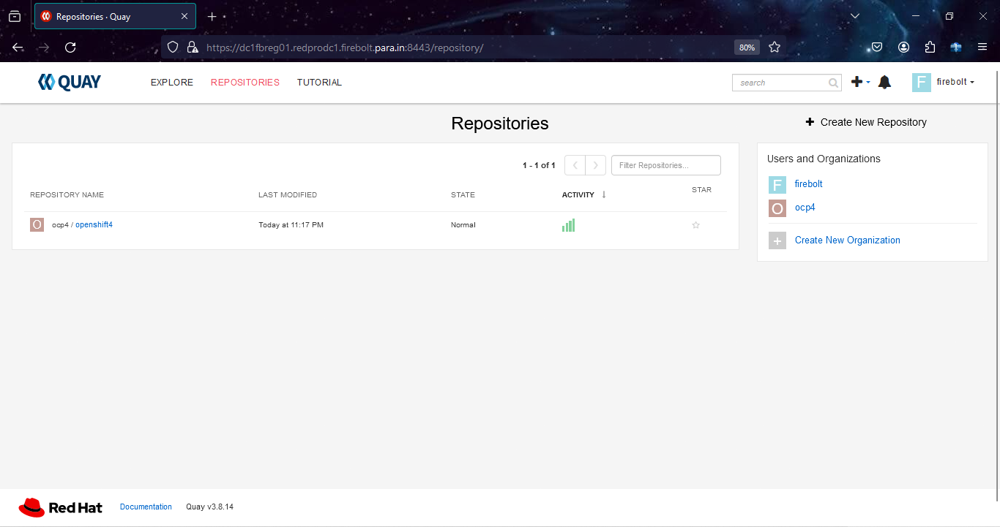
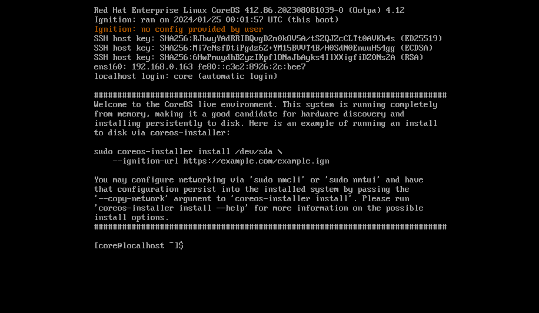
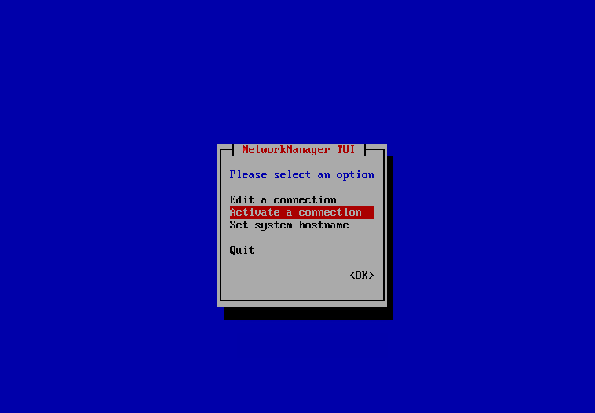
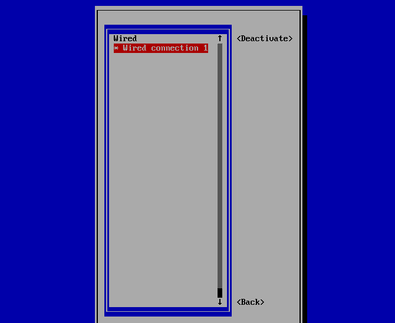
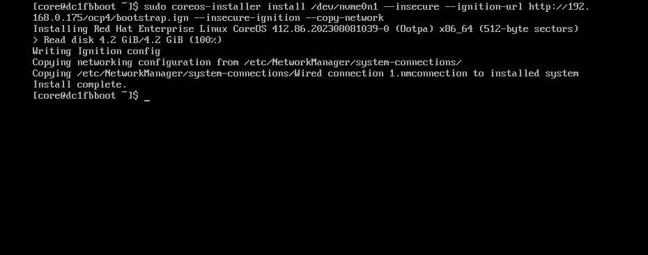
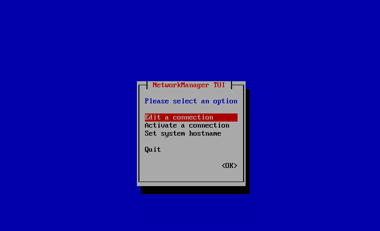
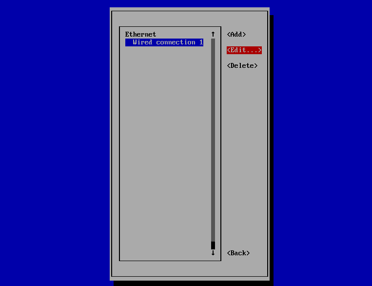
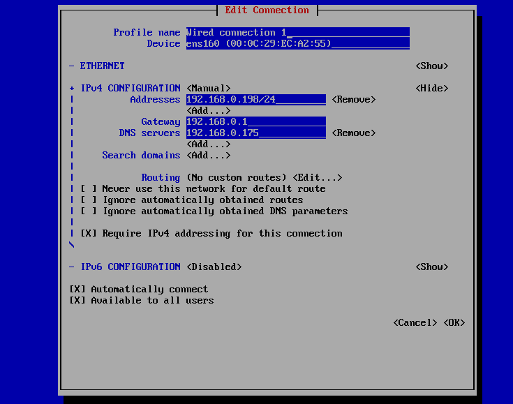
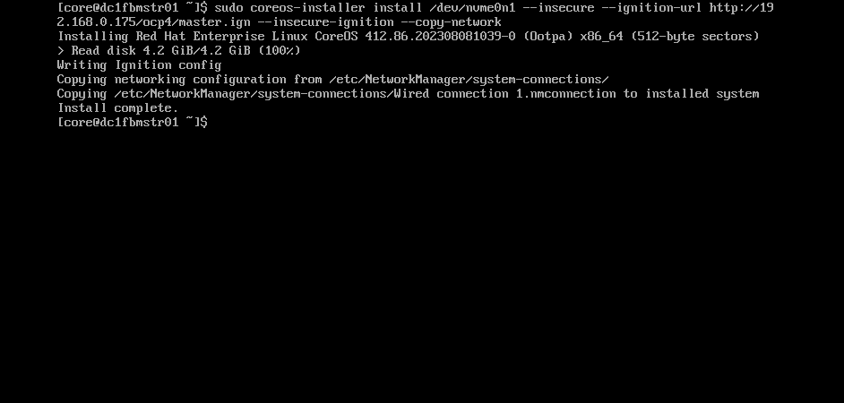

# 🖧 Environment: Prepare Quay Mirror Registry. 
 
 #### ✅ Install podman and container-selinux packages for standalone registry

    [root@dc1bhkreg mirror]# mkdir /mirror ; cd /mirror 
    [root@dc1bhkreg mirror]# yum module install container-tools:4.0 -y

#### ✅ Reset the yum module container-tools. 

    [root@dc1bhkreg mirror]# yum module reset container-tools
    Updating Subscription Management repositories.
    Last metadata expiration check: 0:25:18 ago on Wednesday 24 January 2024 07:23:16 PM IST.
    Dependencies resolved.
    ========================================================================================================================================================================================
     Package                                     Architecture                               Version                                       Repository                                   Size
    ========================================================================================================================================================================================
    Resetting modules:
     container-tools
    
    Transaction Summary
    ========================================================================================================================================================================================
    
    Is this ok [y/N]: y
    Complete!
 
 #### ✅ Install Container-tools module package bundle. 
   
    [root@dc1bhkreg ~]# yum module install container-tools:4.0

#### ✅ Check podman and buildah version needed for Quay Mirror Registry as it needs podman version greater than 3.0

    [root@dc1bhkreg ~]# skopeo -v
    skopeo version 1.6.2-maint

    [root@dc1bhkreg ~]# podman version
    Client:       Podman Engine
    Version:      4.0.2
    API Version:  4.0.2
    Go Version:   go1.20.6
    Built:      Thu Dec  7 14:33:52 2023
    OS/Arch:    linux/amd64

### 🔁 Restart Podman. 

    [root@dc1bhkreg ~]# systemctl enable --now podman.socket podman.service
    Created symlink /etc/systemd/system/sockets.target.wants/podman.socket → /usr/lib/systemd/system/podman.socket.
    Created symlink /etc/systemd/system/default.target.wants/podman.service → /usr/lib/systemd/system/podman.service.

 ## ✅  Install the Quay Mirror Registry

   
 #### ✅ Listing block disk [Add raw disk (sda)]

    [root@dc1bhkreg ~]# lsblk
    NAME          MAJ:MIN RM  SIZE RO TYPE MOUNTPOINT
    sda             8:0    0  780G  0 disk 
    sr0            11:0    1 11.3G  0 rom  /run/media/root/RHEL-8-7-0-BaseOS-x86_64
    nvme0n1       259:0    0  560G  0 disk 
    ├─nvme0n1p1   259:1    0    1G  0 part /boot/efi
    ├─nvme0n1p2   259:2    0    1G  0 part /boot
    └─nvme0n1p3   259:3    0  558G  0 part 
      ├─rhel-root 253:0    0  555G  0 lvm  /
      └─rhel-swap 253:1    0    3G  0 lvm  [SWAP]

 #### ✅ Make filesystem. 

    [root@dc1bhkreg ~]# mkfs.xfs /dev/sda 
    meta-data=/dev/sda               isize=512    agcount=4, agsize=51118080 blks
             =                       sectsz=512   attr=2, projid32bit=1
             =                       crc=1        finobt=1, sparse=1, rmapbt=0
             =                       reflink=1    bigtime=0 inobtcount=0
    data     =                       bsize=4096   blocks=204472320, imaxpct=25
             =                       sunit=0      swidth=0 blks
    naming   =version 2              bsize=4096   ascii-ci=0, ftype=1
    log      =internal log           bsize=4096   blocks=99840, version=2
             =                       sectsz=512   sunit=0 blks, lazy-count=1
    realtime =none                   extsz=4096   blocks=0, rtextents=0
    
 #### ✅ Create a mount directory. 
    
    [root@dc1bhkreg ~]# mkdir /ocpregistry 

 #### ✅ Temporary mount 
    
    [root@dc1bhkreg ~]# mount /dev/sda /ocpregistry/ -v
    mount: /dev/sda mounted on /ocpregistry.

 #### ✅ Persistent mount disk. 
    
    [root@dc1bhkreg ~]# echo "/dev/sda /ocpregistry xfs defaults 0 0" >> /etc/fstab 
    

 #### ✅ Create a mirror directory for quay registry. 

    [root@dc1bhkreg ~]# mkdir  /ocpregistry/mirror 

    [root@dc1bhkreg ocpregistry]# ls
    mirror-registry.tar.gz 
    [root@dc1bhkreg ~]# cd /ocpregistry/mirror

 #### ✅ Extract mirror-registry.tar.gz to ocpregistry directory. 

    [root@dc1bhkreg mirror]# tar xf mirror-registry.tar.gz -C /ocpregistry/mirror 

 #### ✅ Install Quay Mirror Registry 

    [root@dc1bhkreg mirror]# ./mirror-registry install --quayHostname dc1bhkreg.ocp4.example.com --quayStorage /ocpregistry/mirror --quayRoot /ocpregistry/mirror --initUser quayadmin --initPassword quaypass
       __   __
      /  \ /  \     ______   _    _     __   __   __
     / /\ / /\ \   /  __  \ | |  | |   /  \  \ \ / /
    / /  / /  \ \  | |  | | | |  | |  / /\ \  \   /
    \ \  \ \  / /  | |__| | | |__| | / ____ \  | |
     \ \/ \ \/ /   \_  ___/  \____/ /_/    \_\ |_|
      \__/ \__/      \ \__
                      \___\ by Red Hat
     Build, Store, and Distribute your Containers
    
    INFO[2024-01-24 19:56:24] Install has begun
    INFO[2024-01-24 19:56:24] Found execution environment at /ocpregistry/mirror/execution-environment.tar 
    INFO[2024-01-24 19:56:24] Loading execution environment from execution-environment.tar 
    INFO[2024-01-24 19:56:28] Detected an installation to localhost        
    INFO[2024-01-24 19:56:28] Did not find SSH key in default location. Attempting to set up SSH keys. 
    INFO[2024-01-24 19:56:28] Generating SSH Key
    INFO[2024-01-24 19:56:28] Generated SSH Key at /root/.ssh/quay_installer 
    INFO[2024-01-24 19:56:28] Adding key to ~/.ssh/authorized_keys
    INFO[2024-01-24 19:56:28] Successfully set up SSH keys
    INFO[2024-01-24 19:56:28] Attempting to set SELinux rules on /root/.ssh/quay_installer 
    WARN[2024-01-24 19:56:28] Could not set SELinux rule. If your system does not have SELinux enabled, you may ignore this. 
    INFO[2024-01-24 19:56:28] Found image archive at /ocpregistry/mirror/Images/image-archive.tar 
    INFO[2024-01-24 19:56:28] Detected an installation to localhost        
    INFO[2024-01-24 19:56:28] Unpacking image archive from /ocpregistry/mirror/Images/image-archive.tar 
    ...

    INFO[2024-01-24 20:00:42] Quay installed successfully, config data is stored in /ocpregistry/mirror
    INFO[2024-01-24 20:00:42] Quay is available at https://dc1bhkreg.ocp4.example.com:8443 with credentials (quayadmin, quaypass)
    

 #### ✅ Certificate pem directory placement.

    [root@dc1bhkreg mirror]# cp /ocpregistry/mirror/quay-rootCA/rootCA.pem /etc/pki/ca-trust/source/anchors/
    [root@dc1bhkreg mirror]# update-ca-trust 

 #### ✅ Quay login testing 

    [root@dc1bhkreg ~]# podman login dc1bhkreg.ocp4.example.com:8443
    Username: firebolt
    Password: 
    Login Succeeded!

 #### ✅ Extract pull-secret from quay mirror registry. 

    [root@dc1bhkreg ~]# podman login dc1bhkreg.ocp4.example.com:8443 --authfile quay-secret.json
    Username: firebolt
    Password: 
    Login Succeeded!
    
    [root@dc1bhkreg ~]# ls quay-secret.json 
    quay-secret.json

 #### ✅ Oneview result of quay-secret.json 
    
    [root@dc1bhkreg ~]# cat quay-secret.json | jq . -c 
    {"auths":{"dc1bhkreg.ocp4.example.com:8443":{"auth":"Zml<REDACTED>R0MSE="}}}

#### ✅ Configure auth.json persistent autologin. 

    [root@dc1bhkreg ~]# mkdir .docker 
    [root@dc1bhkreg ~]# cp quay-secret.json .docker/config

#### ✅ Setting up variables requirements for ocp images

    [root@dc1bhkreg ~]# vim openshift-vars.sh 
    export OCP_RELEASE=4.18.30
    export LOCAL_REGISTRY=dc1bhkreg.ocp4.example.com:8443
    export LOCAL_REPOSITORY=ocp4/openshift4
    export REG_CREDS=/root/quay-secret.json
    export PRODUCT_REPO=openshift-release-dev
    export RELEASE_NAME=ocp-release
    export ARCHITECTURE=x86_64
    export GODEBUG=x509ignoreCN=0
    export REMOVABLE_MEDIA_PATH=/ocpregistry/ocp-base-images

    [root@dc1bhkreg ~]# source openshift-vars.sh 
    
    [root@dc1bhkreg ~]# echo $LOCAL_REGISTRY
    dc1bhkreg.ocp4.example.com:8443

#### ✅ Quay Login Dashboard. 


## ✅  Mirror OCP 4.18 Images to Quay Mirror Registry

Download and Install oc-mirror cli command line tool to use the plugin to download images.

    [root@dc1bhkreg ~]# chmod a+x /usr/bin/oc-mirror
    [root@dc1bhkreg ~]# oc-mirror version
    Logging to .oc-mirror.log
    Client Version: version.Info{Major:"", Minor:"", GitVersion:"4.18.0-202401090213.p0.g7691686.assembly.stream-7691686", GitCommit:"7691686f8670c0d52ce9d903689f572f8dd2b8d0", GitTreeState:"clean", BuildDate:"2024-01-09T02:34:29Z", GoVersion:"go1.20.10 X:strictfipsruntime", Compiler:"gc", Platform:"linux/amd64"}

Pushing OCP-Base-Images

#### Note
- If Internet is available on registry node, download the ocp-base-images. 

```yml
[root@dc1bhkreg ~]# oc adm release mirror -a ${LOCAL_SECRET_JSON} --from=quay.io/${PRODUCT_REPO}/${RELEASE_NAME}:${OCP_RELEASE}-${ARCHITECTURE} --to=${LOCAL_REGISTRY}/${LOCAL_REPOSITORY} --to-release-image=${LOCAL_REGISTRY}/${LOCAL_REPOSITORY}:${OCP_RELEASE}-${ARCHITECTURE} 
```
or

 #### ✅ Pulling Mirror Images

```yml
[root@dc1bhkreg ~]# oc adm release mirror -a ${LOCAL_SECRET_JSON} --to-dir=${REMOVABLE_MEDIA_PATH}/mirror quay.io/${PRODUCT_REPO}/${RELEASE_NAME}:${OCP_RELEASE}-${ARCHITECTURE}

info: Mirroring completed in 27m37.88s (10.73MB/s)
Success
Update image:  openshift/release:4.18.47-x86_64
To upload local images to a registry, run:
    
oc image mirror --from-dir=/ocpregistry/ocp-base-images/mirror 'file://openshift/release:4.18.47-x86_64*' REGISTRY/REPOSITORY
    
Configmap signature file /ocpregistry/ocp-base-images/mirror/config/signature-sha256-fcc9920ba10ebb02.json created
```

#### ✅ Pushing Mirror Images to Quay Mirror.

```yml

[root@dc1bhkreg ~]# oc image mirror -a ${REG_CREDS} --from-dir=${REMOVABLE_MEDIA_PATH}/mirror "file://openshift/release:${OCP_RELEASE}*" ${LOCAL_REGISTRY}/${LOCAL_REPOSITORY}
dc1bhkreg.ocp4.example.com:8443/
  ocp4/openshift4
  ocp4/openshift4
    blobs:
        file://openshift/release sha256:d8190195889efb5333eeec18af9b6c82313edd4db62989bd3a357caca4f13f0e 1.404KiB
        file://openshift/release sha256:4be070dd54889436046224a7993fea8e507fd4658785912352688456b6359386 1.75KiB
        file://openshift/release sha256:42267abce977809b519fbc11daa547a2bdb536196f4929d4c64ab1b8041c5a28 2.165KiB
        file://openshift/release sha256:97403af2fb7a399279df16b48b7eeb2375071d5d8c589dc025263fe8ce833d77 5.002KiB
        file://openshift/release sha256:72ca6cdfb1b95ac3048635f962ffb7976b0cb6c1cb448e369bb0d3d8e652b6cd 6.773KiB
        file://openshift/release sha256:3590fbc8933489a552db36152fc8eb709faf7c385662603adcc91ec3c60accbd 7.34KiB
        ...
        sha256:27823d86bc46b20e664a97171af1d0402e0 dc1bhkreg.ocp4.example.com:8443/ocp4/openshift4:4.18.47-x86_64-gcp-machine-controllers
        sha256:033e003bea6bd4e309c895fdce376b95ad4 dc1bhkreg.ocp4.example.com:8443/ocp4/openshift4:4.18.47-x86_64-ovirt-csi-driver-operator
        sha256:90ada2d402bb269aef79a57ddf4869e61e8 dc1bhkreg.ocp4.example.com:8443/ocp4/openshift4:4.18.47-x86_64-cluster-capi-operator
        sha256:7f713e1cb0d35e90ab370000206e4bfb13b dc1bhkreg.ocp4.example.com:8443/ocp4/openshift4:4.18.47-x86_64-multus-admission-controller
        sha256:587ec4752bcf9a933c204fe3e95ff0f7bfd dc1bhkreg.ocp4.example.com:8443/ocp4/openshift4:4.18.47-x86_64-rhel-coreos-8-extensions
        sha256:83d2e39417dca9e8f984bc6c1267db598d7 dc1bhkreg.ocp4.example.com:8443/ocp4/openshift4:4.18.47-x86_64-vsphere-cloud-controller-manager
        sha256:8335b64c6d928f1c08acf7683c7142ecd68 dc1bhkreg.ocp4.example.com:8443/ocp4/openshift4:4.18.47-x86_64-gcp-pd-csi-driver-operator
        info: Mirroring completed in 1m31.62s (194.2MB/s)
```        
#### ✅ Extract openshift-install. 

    [root@dc1bhkreg ~]# oc adm release extract -a ${LOCAL_SECRET_JSON} --command=openshift-install "${LOCAL_REGISTRY}/${LOCAL_REPOSITORY}:${OCP_RELEASE}-${ARCHITECTURE}"
    
    [root@dc1bhkreg ~]# openshift-install version
        openshift-install 4.18.47
        built from commit 102949233e8f7c89cc32dcde021bbc76651e48a3
        release image quay.io/openshift-release-dev/ocp-release@sha256:2dda17736b7b747b463b040cb3b7abba9c4174b0922e2fd84127e3887f6d69c5
        release architecture amd64    

#### ✅ Listing Operators after pushed in Quay registry.



#### ✅ Installing a OpenShift Cluster in a Disconnected Network on Baremetal Machines

Installing a OpenShift Cluster Setup.

Generating an SSH private key and adding it to the agent

    [root@dc1bhkreg ~]# ssh-keygen -t ed25519 -N ''
    Generating public/private ed25519 key pair.
    Enter file in which to save the key (/root/.ssh/id_ed25519):
    Created directory '/root/.ssh'.
    Your identification has been saved in /root/.ssh/id_ed25519.
    Your public key has been saved in /root/.ssh/id_ed25519.pub.
    The key fingerprint is:
    SHA256:z3mXx9Pe/hPC6dCkVtQB3NOc05NqoxTVnysV+OSAD6I root@dc1bhkreg.ocp4.example.com
    The key's randomart image is:
    +--[ED25519 256]--+
    |            +o*o*|
    |         . + = %+|
    |        . . = * B|
    |       E   . B =.|
    |        S . O + .|
    |         o * * =.|
    |          = + =.=|
    |           . o +o|
    |               .B|
    +----[SHA256]-----+
    
    [root@dc1bhkreg ~]# cat .ssh/id_ed25519.pub 
    ssh-ed25519 AAAAC3NzaC1{<REDACTED>}DIUeZJkdjTaMRkzn root@dc1bhkreg.ocp4.example.com
    
#### ✅ Manually creating the installation configuration file

    [root@dc1bhkreg ocp4]# cat install-config.yaml 
    apiVersion: v1
    baseDomain: example.com
    compute:
    - hyperthreading: Enabled
      name: worker 
      replicas: 0 
    controlPlane:
    	hyperthreading: Enabled
    	name: master
    	replicas: 1
    metadata:
    	name: lab
    networking:
    	clusterNetwork:
        - cidr: 10.128.0.0/14
        	hostPrefix: 23
      networkType: OVNKubernetes
      serviceNetwork:
        - 172.30.0.0/16
    platform:
    	none: {}
    fips: false
    pullSecret: '{"auths":{"dc1bhkreg.lab.example.com:8443":{"auth":"b3BlbnNoaWZ0OkFzaW1vdkAxMjM="}}}'
    sshKey: "ssh-ed25519 AAAAC3NzaC1lZDI1NTE5AAAAIAV1pNiahN1jaRH9lCWrfi2K6n1ylyqETxazjy42d/8Q root@dc1bhkreg.lab.example.com"
    additionalTrustBundle: |
			-----BEGIN CERTIFICATE-----
			MIIDzDCCArSgAwIBAgIUVHys/JNFdyifJGohRl9WXf8kwn0wDQYJKoZIhvcNAQEL
			BQAwcTELMAkGA1UEBhMCVVMxCzAJBgNVBAgMAlZBMREwDwYDVQQHDAhOZXcgWW9y
			azENMAsGA1UECgwEUXVheTERMA8GA1UECwwIRGl2aXNpb24xIDAeBgNVBAMMF2Jh
			c3Rpb24ubGFiLmV4YW1wbGUuY29tMB4XDTI0MDQwNTE0NTEyOFoXDTI3MDEyNDE0
			NTEyOFowcTELMAkGA1UEBhMCVVMxCzAJBgNVBAgMAlZBMREwDwYDVQQHDAhOZXcg
			WW9yazENMAsGA1UECgwEUXVheTERMA8GA1UECwwIRGl2aXNpb24xIDAeBgNVBAMM
			F2Jhc3Rpb24ubGFiLmV4YW1wbGUuY29tMIIBIjANBgkqhkiG9w0BAQEFAAOCAQ8A
			MIIBCgKCAQEAqDhJV0f3xJdRNhTi31SChb55v8j9kA/0Ay85f0rPw07Trleh011u
			5DsUDhOpIteCsce8IluNLjlrIBwg+G+h/ryZXl48ZXa4pm+JVefOsCggFA66+XU/
			044sITdtqJJYqey9spDXMs4+jSOLO43X6lNE5dsWx90Dorw9yFi2QOwhlTCa+OGH
			8fCL7Vdh47743Mc7k7BpBOLim5t3ulsBhpfkv47SjvyJIkvAqP39/W/6QdxVMYcE
			5VUoj3p7+juDAkW/RDOiiLdhf0pTj091eBbUgYFsmKeEZxqK3gM0MGdBWlU2w5bf
			xIBMH+GDbZOSWg8F5BJixYvNfpvB2m2WpQIDAQABo1wwWjALBgNVHQ8EBAMCAuQw
			EwYDVR0lBAwwCgYIKwYBBQUHAwEwIgYDVR0RBBswGYIXYmFzdGlvbi5sYWIuZXhh
			bXBsZS5jb20wEgYDVR0TAQH/BAgwBgEB/wIBATANBgkqhkiG9w0BAQsFAAOCAQEA
			UfgSS7c0d8lL5nQ06STtW3B9kuW8Jka162BJkndmFhHuHo9KKpHvi1CKolI0TCtc
			WNXzu+Pf9nadbP4sho6Ti+m71cQMJcpOxYu37skcGlXzbJ+uraoQ47jEORFRRJjH
			fyw2stDe2T7CWo95opHplOTPRUIOMxrGkm3eg1I6lcJhwyqMIN3fT+ltM2bSwqIE
			kU3mSqx9GTcAylCkupdm0emCe5eVzSvBski1ke5MJJ4rbNjw6SsOki/KLNQCbTXZ
			+gbp0Ih+uPiEQFX3YUaFcG4dXlCcvIq68kkBY8JoCqpUQIpQP+kvTKUkUiJp4Qhi
			gkmzx7aiMqiYY4MYsR2kEA==
			-----END CERTIFICATE-----
    imageContentSources:
    - mirrors:
      - dc1bhkreg.lab.example.com:8443/ocp4/openshift4
      source: quay.io/openshift-release-dev/ocp-release
    - mirrors:
      - dc1bhkreg.lab.example.com:8443/ocp4/openshift4
      source: quay.io/openshift-release-dev/ocp-v4.0-art-dev


#### ✅ Creating the Openshift/Kubernetes manifest

    [root@dc1bhkreg ~]# ./openshift-install create manifests --dir ocp4/
    INFO Consuming Install Config from target directory 
    WARNING Making control-plane schedulable by setting MastersSchedulable to true for Scheduler cluster settings 
    INFO Manifests created in: ocp4/manifests and ocp4/openshift 

#### ✅ Creating the Openshift/Kubernetes cluster scheduling false. 

    [root@dc1bhkreg ocp4]# ls
    manifests  openshift

    [root@dc1bhkreg ocp4]# cd manifests/

    [root@dc1bhkreg manifests]# ls
    cluster-config.yaml                   cluster-network-01-crd.yml       cvo-overrides.yaml                  kube-system-configmap-root-ca.yaml        
    cluster-dns-02-config.yml             cluster-network-02-config.yml    Images/image-content-source-policy-0.yaml  machine-config-server-tls-secret.yaml     
    cluster-infrastructure-02-config.yml  cluster-proxy-01-config.yaml     Images/image-content-source-policy-1.yaml  openshift-config-secret-pull-secret.yaml  
    cluster-ingress-02-config.yml         cluster-scheduler-02-config.yml  kube-cloud-config.yaml              user-ca-bundle-config.yaml

#### ✅ Edit cluster scheduler.

    [root@dc1bhkreg manifests]# vim cluster-scheduler-02-config.yml
    apiVersion: config.openshift.io/v1
    kind: Scheduler
    metadata:
      creationTimestamp: null
      name: cluster
    spec:
      mastersSchedulable: false
      policy:
        name: ""
    status: {}

#### ✅ Creating the Openshift/Kubernetes ignition files.

    [root@dc1bhkreg ~]# ./openshift-install create ignition-configs --dir=ocp4
    INFO Consuming Openshift Manifests from target directory 
    INFO Consuming OpenShift Install (Manifests) from target directory 
    INFO Consuming Worker Machines from target directory 
    INFO Consuming Common Manifests from target directory 
    INFO Consuming Master Machines from target directory 
    INFO Ignition-Configs created in: ocp4 and ocp4/auth 

#### ✅ Install and Configure Apache HTTPD Server

    [root@dc1bhkreg ~]# yum install httpd -y

#### ✅ Create new directory ocp4. 

    [root@dc1bhkreg ~]# mkdir /var/www/html/ocp4 

#### ✅ Copying all ignition files to web directory. 

    [root@dc1bhkreg ~]# cp -rf ocp4/*.ign /var/www/html/ocp4/

#### ✅ Changing Ownership and Permissions.

    [root@dc1bhkreg ~]# chown apache:apache -R /var/www/html/ocp4/
    [root@dc1bhkreg ~]# chmod 644 -R /var/www/html/ocp4/*.ign
    
    [root@dc1bhkreg html]# cd /var/www/html/ocp4/
    [root@dc1bhkreg ocp4]# ll
    total 284
    -rw-r--r-- 1 apache apache 280395 Jan 24 23:37 bootstrap.i    gn
    -rw-r--r-- 1 apache apache   1728 Jan 24 23:37 master.ign
    -rw-r--r-- 1 apache apache   1728 Jan 24 23:37 worker.ign
 
#### ✅ Checking output of web server. 
       
    [root@dc1bhkreg ocp4]# curl http://dc1bhkreg.ocp4.example.com/ocp4/
    <!DOCTYPE HTML PUBLIC "-//W3C//DTD HTML 3.2 Final//EN">
    <html>
     <head>
      <title>Index of /ocp4</title>
     </head>
     <body>
    <h1>Index of /ocp4</h1>
      <table>
       <tr><th valign="top"></th><th><a href="?C=N;O=D">Name</a></th><th><a href="?C=M;O=A">Last modified</a></th><th><a href="?C=S;O=A">Size</a></th><th><a href="?C=D;O=A">Description</a></th></tr>
       <tr><th colspan="5"><hr></th></tr>
    <tr><td valign="top"></td><td><a href="/">Parent Directory</a>       </td><td>&nbsp;</td><td align="right">  - </td><td>&nbsp;</td></tr>
    <tr><td valign="top"></td><td><a href="bootstrap.ign">bootstrap.ign</a>          </td><td align="right">2024-01-24 23:37  </td><td align="right">274K</td><td>&nbsp;</td></tr>
    <tr><td valign="top"></td><td><a href="master.ign">master.ign</a>             </td><td align="right">2024-01-24 23:37  </td><td align="right">1.7K</td><td>&nbsp;</td></tr>
    <tr><td valign="top"></td><td><a href="worker.ign">worker.ign</a>             </td><td align="right">2024-01-24 23:37  </td><td align="right">1.7K</td><td>&nbsp;</td></tr>
       <tr><th colspan="5"><hr></th></tr>
    </table>
    </body></html>

#### ✅ Prepare Bootstrap Node 

Boot RHCOS Image -> Configure Networking -> Install coreos-installer -> reboot



- nmtui -> edit a connection -> ens33 -> ipv4 configuration -> gateway -> dns -> ok 


- nmtui -> activate a connection -> disable -> enable 




- coreos-installer install /dev/sda --ignition-url http://192.168.1.195/ocp4/bootstrap.ign --insecure --insecure-ignition --copy-network 



- reboot

## Preparing Masters Node 

Boot RHCOS Image -> Configure Networking -> Install coreos-installer -> reboot


- nmtui -> edit a connection -> ens33 -> ipv4 configuration -> gateway -> dns -> ok 





- nmtui -> activate a connection -> disable -> enable 



- coreos-installer install /dev/sda --ignition-url http://192.168.1.195/ocp4/bootstrap.ign --insecure --insecure-ignition --copy-network 



- reboot

#### ✅ Preparing Infra Node 

Boot RHCOS Image -> Configure Networking -> Install coreos-installer -> reboot
- nmtui -> edit a connection -> ens33 -> ipv4 configuration -> gateway -> dns -> ok 
- nmtui -> activate a connection -> disable -> enable 
- coreos-installer install /dev/sda --ignition-url http://192.168.1.195/ocp4/master.ign --insecure --insecure-ignition --copy-network 
- reboot

#### ✅ Preparing Worker Node

Boot RHCOS Image -> Configure Networking -> Install coreos-installer -> reboot
- nmtui -> edit a connection -> ens33 -> ipv4 configuration -> gateway -> dns -> ok 
- nmtui -> activate a connection -> disable -> enable 
- coreos-installer install /dev/sda --ignition-url http://192.168.1.195/ocp4/worker.ign --insecure --insecure-ignition --copy-network 
- reboot

## ✅  Openshift 4.18 Bootstrap Node.

Login to bootstrap node. 

    [root@dc1bhkreg ~]# ssh core@192.168.1.197
    Warning: Permanently added '192.168.1.197' (ECDSA) to the list of known hosts.
    Red Hat Enterprise Linux CoreOS 412.86.202308081039-0
      Part of OpenShift 4.18, RHCOS is a Kubernetes native operating system
      managed by the Machine Config Operator (`clusteroperator/machine-config`).
    
    WARNING: Direct SSH access to machines is not recommended; instead,
    make configuration changes via `machineconfig` objects:
      https://docs.openshift.com/container-platform/4.18/architecture/architecture-rhcos.html
    
    ---
    This is the bootstrap node; it will be destroyed when the master is fully up.
    
    The primary services are release-image.service followed by bootkube.service. To watch their status, run e.g.
    
      journalctl -b -f -u release-image.service -u bootkube.service

    [core@dc1bhkboot ~]$  journalctl -b -f -u release-image.service -u bootkube.service
    -- Logs begin at Wed 2024-01-24 19:34:14 UTC. --
    Jan 24 19:34:29 boot.ocp4.example.com systemd[1]: Starting Download the OpenShift Release Image...
    Jan 24 19:34:29 boot.ocp4.example.com release-Images/image-download.sh[1904]: Pulling dc1bhkreg.ocp4.example.com:8443/ocp4/openshift4@sha256:fcc9920ba10ebb02c69bdd9cd597273260eeec1b22e9ef9986a47f4874a21253...
    Jan 24 19:34:29 boot.ocp4.example.com release-Images/image-download.sh[1977]: 4be070dd54889436046224a7993fea8e507fd4658785912352688456b6359386
    Jan 24 19:34:29 boot.ocp4.example.com systemd[1]: Started Download the OpenShift Release Image.
    Jan 24 19:34:31 boot.ocp4.example.com systemd[1]: Started Bootstrap a Kubernetes cluster.

#### ✅  Monitor the Bootstrap Process

You can monitor the bootstrap process from the dc1bhkreg host at different log levels (debug, error, info)

    [root@dc1bhkreg ~]# ~/openshift-install --dir ~/ocp4 wait-for bootstrap-complete --log-level=debug

Once bootstrapping is complete the boot.ocp4.example.com node can be removed

## ✅  Openshift Skeleton Deployment

#### ✅  Wait for installation to complete

    [root@dc1bhkreg ~]# ~/openshift-install --dir ~/ocp4 wait-for install-complete

Continue to join the worker nodes to the cluster in a new tab whilst waiting for the above command to complete


#### ✅ Setup 'oc' and 'kubectl' clients on the ocp-svc machine

    [root@dc1bhkreg ~]# export KUBECONFIG=~/ocp4/auth/kubeconfig

#### ✅ Test auth by viewing cluster nodes

    [root@dc1bhkreg ~]# oc get nodes

#### ✅ View and approve pending CSRs

View CSRs

    [root@dc1bhkreg ~]# oc get csr

Approve all pending CSRs

    [root@dc1bhkreg ~]# oc get csr -o go-template='{{range .items}}{{if not .status}}{{.metadata.name}}{{"\n"}}{{end}}{{end}}' | xargs oc adm certificate approve

Wait for kubelet-serving CSRs and approve them too with the same command

    [root@dc1bhkreg ~]# oc get csr -o go-template='{{range .items}}{{if not .status}}{{.metadata.name}}{{"\n"}}{{end}}{{end}}' | xargs oc adm certificate approve


#### ✅ How to configure an HTPasswd identity provider in OpenShift 4?

#### ✅ Prerequisites

* You must have configured at least one identity provider.
* You must have added the cluster-admin role to a user.
* You must be logged in as an administrator.


Configuration for OpenShift Container Platform 4

1. Create an HTPasswd file by installing the htpasswd utility by installing the httpd-tools package:
     
      ```yml
    [root@dc1bhkreg ~]# sudo yum install httpd-tools
      ```
     
1. Create or update an users.htpasswd file (note that the -c option will rewrite and truncate the file if already exists) with a user name and hashed password:
     
      ```yml
    [root@dc1bhkreg ~]# htpasswd -c -B -b /tmp/users.htpasswd ocpadmin redhat
    [root@dc1bhkreg ~]# htpasswd  -B -b users.htpasswd sam redhat
    [root@dc1bhkreg ~]# htpasswd  -B -b users.htpasswd kajal redhat
    [root@dc1bhkreg ~]# htpasswd  -B -b users.htpasswd vedik redhat
      ```
      
1. Create the HTPasswd Secret with the previously created users.htpasswd file:
     
      ```yml
    [root@dc1bhkreg ~]# oc create secret generic htpass-secret --from-file=htpasswd=/tmp/users.htpasswd  -n openshift-config
      ```
     
1. Create a custom resource for an HTPasswd identity provider:
     
      ```yml
    [root@dc1bhkreg ~]# $ cat auth.cr
    apiVersion: config.openshift.io/v1
    kind: OAuth
    metadata:
      name: cluster
    spec:
      identityProviders:
      - name: blackhawk_users
        challenge: true
        login: true
        mappingMethod: claim
        type: HTPasswd
        htpasswd:
          fileData:
            name: htpass-secret
      ```
     
1. Apply the defined CR:
     
      ```yml
    [root@dc1bhkreg ~]#  oc apply -f auth.cr
      ```
1. Assign cluster-admin role to ocpadmin user. 

      ```yml
    [root@dc1bhkreg ~]#  oc adm add-cluster-role-to-user cluster-admin ocpadmin
      ```

1. Now login using newly created user:
     
      ```yml
    [root@dc1bhkreg ~]# oc login -u ocpadmin -p redhat 
      ```
     
1. Confirm that the user logged in successfully, and display the user name:
     
      ```yml
    [root@dc1bhkreg ~]# oc whoami
      ```
     
### ✅ Removing the kubeadmin user

After you define an identity provider and create a new cluster-admin user, you can remove the kubeadmin to improve cluster security.


> **[!WARNING]**
> If you follow this procedure before another user is a cluster-admin, then OpenShift Container Platform must be reinstalled. It is not possible to undo this command.

#### ✅ Retrieve the kubeadmin secret details as shown below
    
    [root@dc1bhkreg ~]# oc get secrets kubeadmin -n kube-system
    NAME        TYPE     DATA   AGE
    kubeadmin   Opaque   1      97d


#### ✅ Remove the kubeadmin secret as shown below


    [root@dc1bhkreg ~]# oc delete secrets kubeadmin -n kube-system
    secret "kubeadmin" deleted


#### ✅ Verify if the kubeadmin secret no more exists as shown below
    
    [root@dc1bhkreg ~]# oc get secrets kubeadmin -n kube-system
    Error from server (NotFound): secrets "kubeadmin" not found


#### ✅ Updating users for an htpasswd identity provider

1. Retrieve the htpasswd file from the htpass-secret Secret object and save the file to your file system

      ```yml
    [root@dc1bhkreg ~]# oc get secret htpass-secret -ojsonpath={.data.htpasswd} -n openshift-config | base64 --decode > users.htpasswd 
      ```

1. Add or remove users from the users.htpasswd file.
    1. To add a new user:

      ```yml
    [root@dc1bhkreg ~]# htpasswd -bB users.htpasswd <username> <password>
      ```

    1. To remove an existing user:

      ```yml
    [root@dc1bhkreg ~]# htpasswd -D users.htpasswd <username>
      ```

1. Replace the htpass-secret Secret object with the updated users in the users.htpasswd file:

      ```yml
    [root@dc1bhkreg ~]# oc create secret generic htpass-secret --from-file=htpasswd=users.htpasswd --dry-run=client -o yaml -n openshift-config | oc replace -f -
      ```

1. If you removed one or more users, you must additionally remove existing resources for each user.
    1. Delete the User object:

      ```yml
    [root@dc1bhkreg ~]# oc delete user <username>
      ```

    1. Delete the Identity object for the user:

      ```yml
    [root@dc1bhkreg ~]# oc delete identity my_htpasswd_provider:<username>
      ```


#### ✅ Move Ingress Controller components to infra/worker nodes

    [root@dc1bhkreg ~]# oc edit ingresscontroller default -n openshift-ingress-operator
    
    spec: 
      nodePlacement:
        nodeSelector:
          matchLabels:
            node-role.kubernetes.io/infra: ""

#### ✅ Deploying Openshift Internal Registry with Persistent Storage

1. Create openshift-image-storage pvc. 

    ```yml
    [root@dc1bhkreg ~]# cat ocp-image-pvc.yaml 
    apiVersion: v1
    kind: PersistentVolumeClaim
    metadata:
      name: openshift-image-storage
    spec:
      accessModes:
        - ReadWriteOnce
      resources:
        requests:
          storage: 100Gi
      storageClassName: your-storage-class`
    ```
2. Patch openshift-image-registry. 

    ```yml
    [root@dc1bhkreg ~]# oc patch configs.imageregistry.operator.openshift.io cluster \
      --type=merge -p '{
      "spec": {
        "storage": {
          "pvc": {
            "claim": "openshift-image-storage"
          }
        },
        "replicas": 2,
        "managementState": "Managed"
      }
    }'
    ```
3. Getting cluster operator. 

    ```yml
    [root@dc1bhkreg ~]# oc get clusteroperator image-registry
    NAME             VERSION   AVAILABLE   PROGRESSING   DEGRADED   SINCE    
    image-registry   4.18.30     True        False         False      ...
    ```

4. Getting resources.

    ```yml
    [root@dc1bhkreg ~]# oc get pvc -n openshift-image-registry
    [root@dc1bhkreg ~]# oc get pods -n openshift-image-registry
    ```

#### ✅ Configure System Clock Sync with NTP Server

#### ✅ Configure master nodes system clock sync with NTP server

