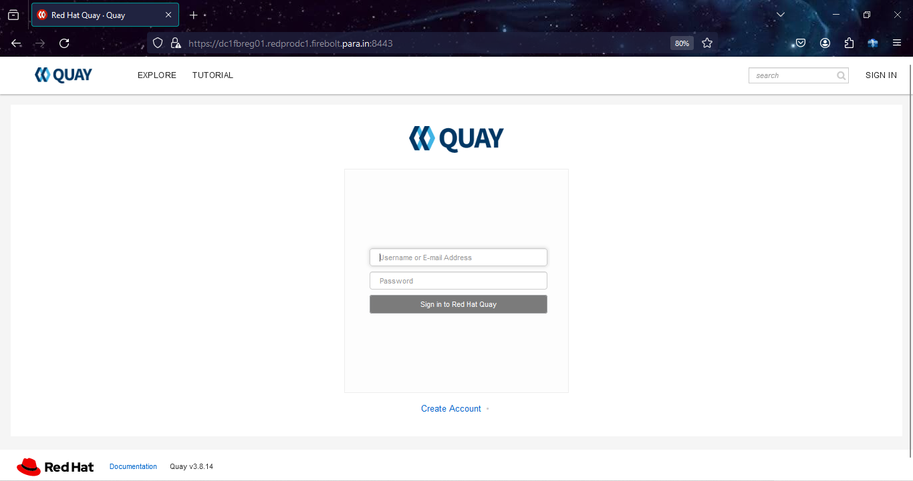

## 2.4 Quay Registry Configuration. 
 
Install podman and container-selinux packages for standalone registry

    [root@dc1fbreg01 mirror]# yum module install container-tools:4.0 -y
    Updating Subscription Management repositories.
    Last metadata expiration check: 0:25:01 ago on Wednesday 24 January 2024 07:23:16 PM IST.
    Dependencies resolved.
    The operation would result in switching of module 'container-tools' stream 'rhel8' to stream '4.0'
    Error: It is not possible to switch enabled streams of a module unless explicitly enabled via configuration option module_stream_switch.
    It is recommended to rather remove all installed content from the module, and reset the module using 'yum module reset <module_name>' command. After you reset the module, you can install the other stream.

Reset the yum module container-tools. 

    [root@dc1fbreg01 mirror]# yum module reset container-tools
    Updating Subscription Management repositories.
    Last metadata expiration check: 0:25:18 ago on Wednesday 24 January 2024 07:23:16 PM IST.
    Dependencies resolved.
    ========================================================================================================================================================================================
     Package                                     Architecture                               Version                                       Repository                                   Size
    ========================================================================================================================================================================================
    Resetting modules:
     container-tools
    
    Transaction Summary
    ========================================================================================================================================================================================
    
    Is this ok [y/N]: y
    Complete!
 
Install Container-tools module package bundle. 
   
    [root@dc1fbreg01 ~]# yum module install container-tools:4.0
    Updating Subscription Management repositories.
    Last metadata expiration check: 0:26:35 ago on Wednesday 24 January 2024 07:23:16 PM IST.
    Dependencies resolved.
    =====================================================================================================================================================
     Package                             Architecture   Version                                           Repository                                Size
    =====================================================================================================================================================
    Upgrading:
     container-selinux                   noarch         2:2.205.0-3.module+el8.9.0+20656+56f336b9         rhel-8-for-x86_64-appstream-rpms          63 k
     containernetworking-plugins         x86_64         1:1.1.1-6.module+el8.9.0+20875+8dd9d5d2           rhel-8-for-x86_64-appstream-rpms          19 M
     criu                                x86_64         3.15-3.module+el8.9.0+20656+56f336b9              rhel-8-for-x86_64-appstream-rpms         518 k
     fuse-overlayfs                      x86_64         1.9-2.module+el8.9.0+20656+56f336b9               rhel-8-for-x86_64-appstream-rpms          74 k
     libnftnl                            x86_64         1.2.2-3.el8                                       rhel-8-for-x86_64-baseos-rpms             87 k
     libslirp                            x86_64         4.4.0-1.module+el8.9.0+20656+56f336b9             rhel-8-for-x86_64-appstream-rpms          70 k
     nftables                            x86_64         1:1.0.4-3.el8_9                                   rhel-8-for-x86_64-baseos-rpms            380 k
     python3-nftables                    x86_64         1:1.0.4-3.el8_9                                   rhel-8-for-x86_64-baseos-rpms             31 k
     runc                                x86_64         1:1.1.5-2.module+el8.9.0+20656+56f336b9           rhel-8-for-x86_64-appstream-rpms         3.1 M
    Installing group/module packages:
     crun                                x86_64         1.8.7-1.module+el8.9.0+20656+56f336b9             rhel-8-for-x86_64-appstream-rpms         238 k
     python3-podman                      noarch         4.0.0-2.module+el8.9.0+20656+56f336b9             rhel-8-for-x86_64-appstream-rpms         149 k
     skopeo                              x86_64         2:1.6.2-9.module+el8.9.0+20656+56f336b9           rhel-8-for-x86_64-appstream-rpms         6.6 M
     toolbox                             x86_64         0.0.99.4-5.module+el8.9.0+20656+56f336b9          rhel-8-for-x86_64-appstream-rpms         2.5 M
     udica                               noarch         0.2.6-4.module+el8.9.0+20656+56f336b9             rhel-8-for-x86_64-appstream-rpms          49 k
    Installing dependencies:
     python3-pytoml                      noarch         0.1.14-5.git7dea353.el8                           rhel-8-for-x86_64-appstream-rpms          25 k
    Installing weak dependencies:
     criu-libs                           x86_64         3.15-3.module+el8.9.0+20656+56f336b9              rhel-8-for-x86_64-appstream-rpms          38 k
    Downgrading:
     buildah                             x86_64         1:1.24.6-7.module+el8.9.0+20656+56f336b9          rhel-8-for-x86_64-appstream-rpms         8.0 M
     cockpit-podman                      noarch         46-1.module+el8.9.0+20656+56f336b9                rhel-8-for-x86_64-appstream-rpms         501 k
     conmon                              x86_64         2:2.1.4-2.module+el8.9.0+20656+56f336b9           rhel-8-for-x86_64-appstream-rpms          56 k
     containers-common                   x86_64         2:1-38.module+el8.9.0+20656+56f336b9              rhel-8-for-x86_64-appstream-rpms         106 k
     podman                              x86_64         2:4.0.2-25.module+el8.9.0+20875+8dd9d5d2          rhel-8-for-x86_64-appstream-rpms          13 M
     podman-catatonit                    x86_64         2:4.0.2-25.module+el8.9.0+20875+8dd9d5d2          rhel-8-for-x86_64-appstream-rpms         356 k
     slirp4netns                         x86_64         1.1.8-3.module+el8.9.0+20656+56f336b9             rhel-8-for-x86_64-appstream-rpms          51 k
    Installing module profiles:
     container-tools/common
    Enabling module streams:
     container-tools                                    4.0
    
    Transaction Summary
    =====================================================================================================================================================
    Install    7 Packages
    Upgrade    9 Packages
    Downgrade  7 Packages
    
    Total download size: 55 M
    Is this ok [y/N]: y

Check podman and buildah version needed for Quay Mirror Registry as it needs podman version greater than 3.0

    [root@dc1fbreg01 ~]# skopeo -v
    skopeo version 1.6.2-maint

    [root@dc1fbreg01 ~]# podman version
    Client:       Podman Engine
    Version:      4.0.2
    API Version:  4.0.2
    Go Version:   go1.20.6
    Built:      Thu Dec  7 14:33:52 2023
    OS/Arch:    linux/amd64

    [root@dc1fbreg01 ~]# systemctl enable --now podman.socket podman.service
    Created symlink /etc/systemd/system/sockets.target.wants/podman.socket → /usr/lib/systemd/system/podman.socket.
    Created symlink /etc/systemd/system/default.target.wants/podman.service → /usr/lib/systemd/system/podman.service.

## Install the Quay Mirror Registry

   
Listing block disk [Add raw disk (sda)]

    [root@dc1fbreg01 ~]# lsblk
    NAME          MAJ:MIN RM  SIZE RO TYPE MOUNTPOINT
    sda             8:0    0  780G  0 disk 
    sr0            11:0    1 11.3G  0 rom  /run/media/root/RHEL-8-7-0-BaseOS-x86_64
    nvme0n1       259:0    0  560G  0 disk 
    ├─nvme0n1p1   259:1    0    1G  0 part /boot/efi
    ├─nvme0n1p2   259:2    0    1G  0 part /boot
    └─nvme0n1p3   259:3    0  558G  0 part 
      ├─rhel-root 253:0    0  555G  0 lvm  /
      └─rhel-swap 253:1    0    3G  0 lvm  [SWAP]

Make filesystem. 

    [root@dc1fbreg01 ~]# mkfs.xfs /dev/sda 
    meta-data=/dev/sda               isize=512    agcount=4, agsize=51118080 blks
             =                       sectsz=512   attr=2, projid32bit=1
             =                       crc=1        finobt=1, sparse=1, rmapbt=0
             =                       reflink=1    bigtime=0 inobtcount=0
    data     =                       bsize=4096   blocks=204472320, imaxpct=25
             =                       sunit=0      swidth=0 blks
    naming   =version 2              bsize=4096   ascii-ci=0, ftype=1
    log      =internal log           bsize=4096   blocks=99840, version=2
             =                       sectsz=512   sunit=0 blks, lazy-count=1
    realtime =none                   extsz=4096   blocks=0, rtextents=0
    
Create a mount directory. 
    
    [root@dc1fbreg01 ~]# mkdir /ocpregistry 

temporary mount 
    
    [root@dc1fbreg01 ~]# mount /dev/sda /ocpregistry/ -v
    mount: /dev/sda mounted on /ocpregistry.

persistent mount disk. 
    
    [root@dc1fbreg01 ~]# echo "/dev/sda /ocpregistry xfs defaults 0 0" >> /etc/fstab 
    

Create a mirror directory for quay registry. 

    [root@dc1fbreg01 ~]# mkdir  /ocpregistry/mirror 

    [root@dc1fbreg01 ocpregistry]# ls
    mirror-registry.tar.gz 
    [root@dc1fbreg01 ~]# cd /ocpregistry/mirror

Extract mirror-registry.tar.gz to ocpregistry directory. 

    [root@dc1fbreg01 mirror]# tar xf mirror-registry.tar.gz -C /ocpregistry/mirror 

Install quay Mirror Registry 

    [root@dc1fbreg01 mirror]# ./mirror-registry install --quayHostname dc1fbreg01.redprodc1.firebolt.para.in --quayStorage /ocpregistry/mirror --quayRoot /ocpregistry/mirror --initUser firebolt --initPassword r3dh4t1! 
       __   __
      /  \ /  \     ______   _    _     __   __   __
     / /\ / /\ \   /  __  \ | |  | |   /  \  \ \ / /
    / /  / /  \ \  | |  | | | |  | |  / /\ \  \   /
    \ \  \ \  / /  | |__| | | |__| | / ____ \  | |
     \ \/ \ \/ /   \_  ___/  \____/ /_/    \_\ |_|
      \__/ \__/      \ \__
                      \___\ by Red Hat
     Build, Store, and Distribute your Containers
    
    INFO[2024-01-24 19:56:24] Install has begun
    INFO[2024-01-24 19:56:24] Found execution environment at /ocpregistry/mirror/execution-environment.tar 
    INFO[2024-01-24 19:56:24] Loading execution environment from execution-environment.tar 
    INFO[2024-01-24 19:56:28] Detected an installation to localhost        
    INFO[2024-01-24 19:56:28] Did not find SSH key in default location. Attempting to set up SSH keys. 
    INFO[2024-01-24 19:56:28] Generating SSH Key
    INFO[2024-01-24 19:56:28] Generated SSH Key at /root/.ssh/quay_installer 
    INFO[2024-01-24 19:56:28] Adding key to ~/.ssh/authorized_keys
    INFO[2024-01-24 19:56:28] Successfully set up SSH keys
    INFO[2024-01-24 19:56:28] Attempting to set SELinux rules on /root/.ssh/quay_installer 
    WARN[2024-01-24 19:56:28] Could not set SELinux rule. If your system does not have SELinux enabled, you may ignore this. 
    INFO[2024-01-24 19:56:28] Found image archive at /ocpregistry/mirror/image-archive.tar 
    INFO[2024-01-24 19:56:28] Detected an installation to localhost        
    INFO[2024-01-24 19:56:28] Unpacking image archive from /ocpregistry/mirror/image-archive.tar 
    ...

    INFO[2024-01-24 20:00:42] Quay installed successfully, config data is stored in /ocpregistry/mirror
    INFO[2024-01-24 20:00:42] Quay is available at https://dc1fbreg01.redprodc1.firebolt.para.in:8443 with credentials (firebolt, r3dh4t1!)
    

Certificate pem directory placement.

    [root@dc1fbreg01 mirror]# cp /ocpregistry/mirror/quay-rootCA/rootCA.pem /etc/pki/ca-trust/source/anchors/
    [root@dc1fbreg01 mirror]# update-ca-trust 

Quay login testing 

    [root@dc1fbreg01 ~]# podman login dc1fbreg01.redprodc1.firebolt.para.in:8443
    Username: firebolt
    Password: 
    Login Succeeded!

Extract pull-secret from quay mirror registry. 

    [root@dc1fbreg01 ~]# podman login dc1fbreg01.redprodc1.firebolt.para.in:8443 --authfile quay-secret.json
    Username: firebolt
    Password: 
    Login Succeeded!
    
    [root@dc1fbreg01 ~]# ls quay-secret.json 
    quay-secret.json

Oneview result of quay-secret.json 
    
    [root@dc1fbreg01 ~]# cat quay-secret.json | jq . -c 
    {"auths":{"dc1fbreg01.redprodc1.firebolt.para.in:8443":{"auth":"Zml<REDACTED>R0MSE="}}}

    [root@dc1fbreg01 ~]# mkdir .docker 
    [root@dc1fbreg01 ~]# cp quay-secret.json .docker/config

Setting up variables requirements for ocp images

    [root@dc1fbreg01 ~]# vim openshift-vars.sh 
    export OCP_RELEASE=4.12.46
    export LOCAL_REGISTRY=dc1fbreg01.redprodc1.firebolt.para.in:8443
    export LOCAL_REPOSITORY=ocp4/openshift4
    export REG_CREDS=/root/quay-secret.json
    export PRODUCT_REPO=openshift-release-dev
    export RELEASE_NAME=ocp-release
    export ARCHITECTURE=x86_64
    export GODEBUG=x509ignoreCN=0
    export REMOVABLE_MEDIA_PATH=/ocpregistry/ocp-base-images

    [root@dc1fbreg01 ~]# source openshift-vars.sh 
    
    [root@dc1fbreg01 ~]# echo $LOCAL_REGISTRY
    dc1fbreg01.redprodc1.firebolt.para.in:8443

Quay Login Dashboard. 

## 2.3. Mirror OCP 4.12 Images to Quay Mirror Registry

Download and Install oc-mirror cli command line tool to use the plugin to download images.

    [root@dc1fbreg01 ~]# chmod a+x /usr/bin/oc-mirror
    [root@dc1fbreg01 ~]# oc-mirror version
    Logging to .oc-mirror.log
    Client Version: version.Info{Major:"", Minor:"", GitVersion:"4.14.0-202401090213.p0.g7691686.assembly.stream-7691686", GitCommit:"7691686f8670c0d52ce9d903689f572f8dd2b8d0", GitTreeState:"clean", BuildDate:"2024-01-09T02:34:29Z", GoVersion:"go1.20.10 X:strictfipsruntime", Compiler:"gc", Platform:"linux/amd64"}

Pushing OCP-Base-Images

> [!NOTE]
> If Internet is available on registry node, download the ocp-base-images. 

    [root@dc1fbreg01 ~]# oc adm release mirror -a ${LOCAL_SECRET_JSON} --to-dir=${REMOVABLE_MEDIA_PATH}/mirror quay.io/${PRODUCT_REPO}/${RELEASE_NAME}:${OCP_RELEASE}-${ARCHITECTURE}

    info: Mirroring completed in 27m37.88s (10.73MB/s)
    Success
    Update image:  openshift/release:4.12.47-x86_64
    To upload local images to a registry, run:
    
        oc image mirror --from-dir=/ocpregistry/ocp-base-images/mirror 'file://openshift/release:4.12.47-x86_64*' REGISTRY/REPOSITORY
    
    Configmap signature file /ocpregistry/ocp-base-images/mirror/config/signature-sha256-fcc9920ba10ebb02.json created
        

    [root@dc1fbreg01 ~]# oc image mirror -a ${REG_CREDS} --from-dir=${REMOVABLE_MEDIA_PATH}/mirror "file://openshift/release:${OCP_RELEASE}*" ${LOCAL_REGISTRY}/${LOCAL_REPOSITORY}
    dc1fbreg01.redprodc1.firebolt.para.in:8443/
      ocp4/openshift4
      ocp4/openshift4
        blobs:
          file://openshift/release sha256:d8190195889efb5333eeec18af9b6c82313edd4db62989bd3a357caca4f13f0e 1.404KiB
          file://openshift/release sha256:4be070dd54889436046224a7993fea8e507fd4658785912352688456b6359386 1.75KiB
          file://openshift/release sha256:42267abce977809b519fbc11daa547a2bdb536196f4929d4c64ab1b8041c5a28 2.165KiB
          file://openshift/release sha256:97403af2fb7a399279df16b48b7eeb2375071d5d8c589dc025263fe8ce833d77 5.002KiB
          file://openshift/release sha256:72ca6cdfb1b95ac3048635f962ffb7976b0cb6c1cb448e369bb0d3d8e652b6cd 6.773KiB
          file://openshift/release sha256:3590fbc8933489a552db36152fc8eb709faf7c385662603adcc91ec3c60accbd 7.34KiB
        ...
        sha256:27823d86bc46b20e664a97171af1d0402e0764c686315102d914d0359280fe98 dc1fbreg01.redprodc1.firebolt.para.in:8443/ocp4/openshift4:4.12.47-x86_64-gcp-machine-controllers
        sha256:033e003bea6bd4e309c895fdce376b95ad4e8a21d018b23f83928ac52a95bbe6 dc1fbreg01.redprodc1.firebolt.para.in:8443/ocp4/openshift4:4.12.47-x86_64-ovirt-csi-driver-operator
        sha256:90ada2d402bb269aef79a57ddf4869e61e1896e440aeb37bc2824fd2795cc2b0 dc1fbreg01.redprodc1.firebolt.para.in:8443/ocp4/openshift4:4.12.47-x86_64-cluster-capi-operator
        sha256:7f713e1cb0d35e90ab370000206e4bfb13b9017ae8a0942e4616a49c6df57080 dc1fbreg01.redprodc1.firebolt.para.in:8443/ocp4/openshift4:4.12.47-x86_64-multus-admission-controller
        sha256:587ec4752bcf9a933c204fe3e95ff0f7bfd575f33de651f2248b7dfc818298c4 dc1fbreg01.redprodc1.firebolt.para.in:8443/ocp4/openshift4:4.12.47-x86_64-rhel-coreos-8-extensions
        sha256:83d2e39417dca9e8f984bc6c1267db598d76268c77f1b074a39cae83972e82b9 dc1fbreg01.redprodc1.firebolt.para.in:8443/ocp4/openshift4:4.12.47-x86_64-vsphere-cloud-controller-manager
        sha256:8335b64c6d928f1c08acf7683c7142ecd68faf942661087b006449d28b5dfb25 dc1fbreg01.redprodc1.firebolt.para.in:8443/ocp4/openshift4:4.12.47-x86_64-gcp-pd-csi-driver-operator
        info: Mirroring completed in 1m31.62s (194.2MB/s)
        

    [root@dc1fbreg01 ~]# oc adm release extract -a ${LOCAL_SECRET_JSON} --command=openshift-install "${LOCAL_REGISTRY}/${LOCAL_REPOSITORY}:${OCP_RELEASE}-${ARCHITECTURE}"

    [root@dc1fbreg01 ~]# openshift-install version
    openshift-install 4.12.47
    built from commit 102949233e8f7c89cc32dcde021bbc76651e48a3
    release image quay.io/openshift-release-dev/ocp-release@sha256:2dda17736b7b747b463b040cb3b7abba9c4174b0922e2fd84127e3887f6d69c5
    release architecture amd64    

Listing Operators after pushed in Quay registry.

## 3. Installing a OpenShift Cluster in a Disconnected Network on Baremetal Machines

3.1. Installing a OpenShift Cluster Setup.

Generating an SSH private key and adding it to the agent

    [root@dc1fbreg01 ~]# ssh-keygen -t ed25519 -N ''
    Generating public/private ed25519 key pair.
    Enter file in which to save the key (/root/.ssh/id_ed25519):
    Created directory '/root/.ssh'.
    Your identification has been saved in /root/.ssh/id_ed25519.
    Your public key has been saved in /root/.ssh/id_ed25519.pub.
    The key fingerprint is:
    SHA256:z3mXx9Pe/hPC6dCkVtQB3NOc05NqoxTVnysV+OSAD6I root@dc1fbreg01.redprodc1.firebolt.para.in
    The key's randomart image is:
    +--[ED25519 256]--+
    |            +o*o*|
    |         . + = %+|
    |        . . = * B|
    |       E   . B =.|
    |        S . O + .|
    |         o * * =.|
    |          = + =.=|
    |           . o +o|
    |               .B|
    +----[SHA256]-----+
    
    [root@dc1fbreg01 ~]# cat .ssh/id_ed25519.pub 
    ssh-ed25519 AAAAC3NzaC1{<REDACTED>}DIUeZJkdjTaMRkzn root@dc1fbreg01.redprodc1.firebolt.para.in
    
Manually creating the installation configuration file

    [root@dc1fbreg01 ocp-redocpdc1]# cat install-config.yaml 
    apiVersion: v1
    baseDomain: firebolt.para.in
    compute:
      - hyperthreading: Enabled
        name: worker 
        replicas: 0 
    controlPlane:
      hyperthreading: Enabled
      name: master
      replicas: 3
    metadata:
      name: redprodc1 
    networking:
      clusterNetwork:
        - cidr: 10.128.0.0/14
          hostPrefix: 23
      networkType: OpenShiftSDN
      serviceNetwork:
        - 172.30.0.0/16
    platform:
      none: {}
    fips: false
    pullSecret: '{"auths":{"dc1fbreg01.redprodc1.firebolt.para.in:8443":{"auth":"Zml<REDACTED>MSE="}}}'
    sshKey: "ssh-ed25519 AAAAC3NzaC1lZDI1N<REDACTED>pKdwdHbQDIUeZJkdjTaMRkzn root@dc1fbreg01.redprodc1.firebolt.para.in"
    additionalTrustBundle: |
      -----BEGIN CERTIFICATE-----
      MIID9jCCAt6gAwIBAgIUTGTTTZFwaGiZYPnw9wMw+DuA1bcwDQYJKoZIhvcNAQEL
      BQAwfzELMAkGA1UEBhMCVVMxCzAJBgNVBAgMAlZBMREwDwYDVQQHDAhOZXcgWW9y
      azENMAsGA1UECgwEUXVheTERMA8GA1UECwwIRGl2aXNpb24xLjAsBgNVBAMMJWRj
      MWZicmVnMDEucmVkcHJvZGMxLmZpcmVib2x0LnBhcmEuaW4wHhcNMjQwMTI0MTQz
      MDA2WhcNMjYxMTEzMTQzMDA2WjB/MQswCQYDVQQGEwJVUzELMAkGA1UECAwCVkEx
      <REDACTED>
      aW4wEgYDVR0TAQH/BAgwBgEB/wIBATANBgkqhkiG9w0BAQsFAAOCAQEAWrpZMeNm
      o0IQy0HVZ4LtxhptTSaCEeVPNUvoJwqnY+WCielBoe4WihZDv64T9QXM83QZfIRO
      Hu1+/jF3l5mT8N0TW2gE/LBZeUHdNZ0ciQriJMQNWIX2RsZ5pOjqmExAOT+iHouI
      okpuTK1ysnjHkgrFTXEMd6vlEeae1AFhvHQ4ZsND1wFWh3JAG7htvEJz6c8bZFdG
      nt2a5pWX7iD6Yn8Idub4zybT86YbGPZbszVa/wRrEPLsOKpcj06G3er2oyKUeoni
      iGFoukO08wiFXkU1b3bSVC1KrhFpa8po7rzo4DW61IYg9K1t1tX5RzsIHSKi7Eks
      8t1mqudWprnvxQ==
      -----END CERTIFICATE-----
    imageContentSources:
    - mirrors:
      - dc1fbreg01.redprodc1.firebolt.para.in:8443/ocp4/openshift4
      source: quay.io/openshift-release-dev/ocp-release
    - mirrors:
      - dc1fbreg01.redprodc1.firebolt.para.in:8443/ocp4/openshift4
      source: quay.io/openshift-release-dev/ocp-v4.0-art-dev

Creating the Openshift/Kubernetes manifest

    [root@dc1fbreg01 ~]# ./openshift-install create manifests --dir ocp-redocpdc1/
    INFO Consuming Install Config from target directory 
    WARNING Making control-plane schedulable by setting MastersSchedulable to true for Scheduler cluster settings 
    INFO Manifests created in: ocp-redocpdc1/manifests and ocp-redocpdc1/openshift 

Creating the Openshift/Kubernetes cluster scheduling false. 

    [root@dc1fbreg01 ocp-redocpdc1]# ls
    manifests  openshift

    [root@dc1fbreg01 ocp-redocpdc1]# cd manifests/

    [root@dc1fbreg01 manifests]# ls
    cluster-config.yaml                   cluster-network-01-crd.yml       cvo-overrides.yaml                  kube-system-configmap-root-ca.yaml        
    cluster-dns-02-config.yml             cluster-network-02-config.yml    image-content-source-policy-0.yaml  machine-config-server-tls-secret.yaml     
    cluster-infrastructure-02-config.yml  cluster-proxy-01-config.yaml     image-content-source-policy-1.yaml  openshift-config-secret-pull-secret.yaml  
    cluster-ingress-02-config.yml         cluster-scheduler-02-config.yml  kube-cloud-config.yaml              user-ca-bundle-config.yaml

    [root@dc1fbreg01 manifests]# vim cluster-scheduler-02-config.yml
    apiVersion: config.openshift.io/v1
    kind: Scheduler
    metadata:
      creationTimestamp: null
      name: cluster
    spec:
      mastersSchedulable: false
      policy:
        name: ""
    status: {}

Creating the Openshift/Kubernetes ignition files.

    [root@dc1fbreg01 ~]# ./openshift-install create ignition-configs --dir=ocp-redocpdc1
    INFO Consuming Openshift Manifests from target directory 
    INFO Consuming OpenShift Install (Manifests) from target directory 
    INFO Consuming Worker Machines from target directory 
    INFO Consuming Common Manifests from target directory 
    INFO Consuming Master Machines from target directory 
    INFO Ignition-Configs created in: ocp-redocpdc1 and ocp-redocpdc1/auth 

Install and Configure Apache HTTPD Server

    [root@dc1fbreg01 ~]# yum install httpd -y

Create new directory ocp4. 

    [root@dc1fbreg01 ~]# mkdir /var/www/html/ocp4 

Copying all ignition files to web directory. 

    [root@dc1fbreg01 ~]# cp -rf ocp-redocpdc1/*.ign /var/www/html/ocp4/

Changing Ownership and Permissions.

    [root@dc1fbreg01 ~]# chown apache:apache -R /var/www/html/ocp4/
    [root@dc1fbreg01 ~]# chmod 644 -R /var/www/html/ocp4/*.ign
    
    [root@dc1fbreg01 html]# cd /var/www/html/ocp4/
    [root@dc1fbreg01 ocp4]# ll
    total 284
    -rw-r--r-- 1 apache apache 280395 Jan 24 23:37 bootstrap.ign
    -rw-r--r-- 1 apache apache   1728 Jan 24 23:37 master.ign
    -rw-r--r-- 1 apache apache   1728 Jan 24 23:37 worker.ign
 
Checking output of web server. 
       
    [root@dc1fbreg01 ocp4]# curl http://dc1fbreg01.redprodc1.firebolt.para.in/ocp4/
    <!DOCTYPE HTML PUBLIC "-//W3C//DTD HTML 3.2 Final//EN">
    <html>
     <head>
      <title>Index of /ocp4</title>
     </head>
     <body>
    <h1>Index of /ocp4</h1>
      <table>
       <tr><th valign="top"></th><th><a href="?C=N;O=D">Name</a></th><th><a href="?C=M;O=A">Last modified</a></th><th><a href="?C=S;O=A">Size</a></th><th><a href="?C=D;O=A">Description</a></th></tr>
       <tr><th colspan="5">
</th></tr>
    <tr><td valign="top"></td><td><a href="/">Parent Directory</a>       </td><td>&nbsp;</td><td align="right">  - </td><td>&nbsp;</td></tr>
    <tr><td valign="top"></td><td><a href="bootstrap.ign">bootstrap.ign</a>          </td><td align="right">2024-01-24 23:37  </td><td align="right">274K</td><td>&nbsp;</td></tr>
    <tr><td valign="top"></td><td><a href="master.ign">master.ign</a>             </td><td align="right">2024-01-24 23:37  </td><td align="right">1.7K</td><td>&nbsp;</td></tr>
    <tr><td valign="top"></td><td><a href="worker.ign">worker.ign</a>             </td><td align="right">2024-01-24 23:37  </td><td align="right">1.7K</td><td>&nbsp;</td></tr>
       <tr><th colspan="5">
</th></tr>
    </table>
    </body></html>

## Preparing Bootstrap Node 

Boot RHCOS Image -> Configure Networking -> Install coreos-installer -> reboot
- nmtui -> edit a connection -> ens33 -> ipv4 configuration -> gateway -> dns -> ok 
- nmtui -> activate a connection -> disable -> enable 
- coreos-installer install /dev/sda --ignition-url http://192.168.0.175/ocp4/bootstrap.ign --insecure --insecure-ignition --copy-network 
- reboot

## Preparing Masters Node 

Boot RHCOS Image -> Configure Networking -> Install coreos-installer -> reboot
- nmtui -> edit a connection -> ens33 -> ipv4 configuration -> gateway -> dns -> ok 
- nmtui -> activate a connection -> disable -> enable 
- coreos-installer install /dev/sda --ignition-url http://192.168.0.175/ocp4/bootstrap.ign --insecure --insecure-ignition --copy-network 
- reboot

## Preparing Infra Node 

Boot RHCOS Image -> Configure Networking -> Install coreos-installer -> reboot
- nmtui -> edit a connection -> ens33 -> ipv4 configuration -> gateway -> dns -> ok 
- nmtui -> activate a connection -> disable -> enable 
- coreos-installer install /dev/sda --ignition-url http://192.168.0.175/ocp4/master.ign --insecure --insecure-ignition --copy-network 
- reboot

## Preparing Worker Node

Boot RHCOS Image -> Configure Networking -> Install coreos-installer -> reboot
- nmtui -> edit a connection -> ens33 -> ipv4 configuration -> gateway -> dns -> ok 
- nmtui -> activate a connection -> disable -> enable 
- coreos-installer install /dev/sda --ignition-url http://192.168.0.175/ocp4/worker.ign --insecure --insecure-ignition --copy-network 
- reboot

# Openshift 4.12 Bootstrapping

## Monitor the Bootstrap Process

You can monitor the bootstrap process from the dc1fbreg01 host at different log levels (debug, error, info)

    [root@dc1fbreg01 ~]# ~/openshift-install --dir ~/ocp-redocpdc1 wait-for bootstrap-complete --log-level=debug

Once bootstrapping is complete the dc1fbboot.redprodc1.firebolt.para.in node can be removed

# Openshift Skeleton Deployment

## Wait for installation to complete

    [root@dc1fbreg01 ~]# ~/openshift-install --dir ~/ocp-redocpdc1 wait-for install-complete

Continue to join the worker nodes to the cluster in a new tab whilst waiting for the above command to complete

Setup 'oc' and 'kubectl' clients on the ocp-svc machine

    [root@dc1fbreg01 ~]# export KUBECONFIG=~/ocp-redocpdc1/auth/kubeconfig

Test auth by viewing cluster nodes

    [root@dc1fbreg01 ~]# oc get nodes

## View and approve pending CSRs

View CSRs

    [root@dc1fbreg01 ~]# oc get csr

Approve all pending CSRs

    [root@dc1fbreg01 ~]# oc get csr -o go-template='{{range .items}}{{if not .status}}{{.metadata.name}}{{"\n"}}{{end}}{{end}}' | xargs oc adm certificate approve

Wait for kubelet-serving CSRs and approve them too with the same command

    [root@dc1fbreg01 ~]# oc get csr -o go-template='{{range .items}}{{if not .status}}{{.metadata.name}}{{"\n"}}{{end}}{{end}}' | xargs oc adm certificate approve

Create Machine Config Pool for infra nodes
Move Ingress Controller components to infra nodes
Moving monitoring components from Worker to Infra labeled nodes
Deploying Openshift Internal Registry with Persistent Storage
Configure System Clock Sync with NTP Server
Configure master nodes system clock sync with NTP server

## 8. Removing the kubeadmin user

After you define an identity provider and create a new cluster-admin user, you can remove the kubeadmin to improve cluster security.

> **[!WARNING]**
> If you follow this procedure before another user is a cluster-admin, then OpenShift Container Platform must be reinstalled. It is not possible to undo this command.

### Prerequisites

* You must have configured at least one identity provider.
* You must have added the cluster-admin role to a user.
* You must be logged in as an administrator.

Retrieve the kubeadmin secret details as shown below
    
    [root@dc1fbreg01 ~]# oc get secrets kubeadmin -n kube-system
    NAME        TYPE     DATA   AGE
    kubeadmin   Opaque   1      97d

Remove the kubeadmin secret as shown below

    [root@dc1fbreg01 ~]# oc delete secrets kubeadmin -n kube-system
    secret "kubeadmin" deleted

Verify if the kubeadmin secret no more exists as shown below
    
    [root@dc1fbreg01 ~]# oc get secrets kubeadmin -n kube-system
    Error from server (NotFound): secrets "kubeadmin" not found
