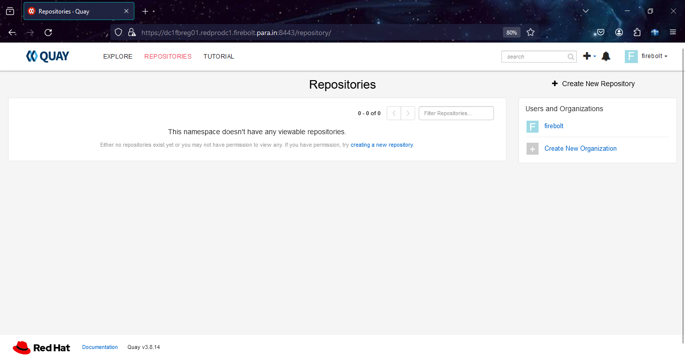

## 2.4 Quay Registry Configuration. 
 
Install podman and container-selinux packages for standalone registry

    [root@dc1fbreg01 mirror]# yum module install container-tools:4.0 -y
    Updating Subscription Management repositories.
    Last metadata expiration check: 0:25:01 ago on Wednesday 24 January 2024 07:23:16 PM IST.
    Dependencies resolved.
    The operation would result in switching of module 'container-tools' stream 'rhel8' to stream '4.0'
    Error: It is not possible to switch enabled streams of a module unless explicitly enabled via configuration option module_stream_switch.
    It is recommended to rather remove all installed content from the module, and reset the module using 'yum module reset <module_name>' command. After you reset the module, you can install the other stream.

Reset the yum module container-tools. 

    [root@dc1fbreg01 mirror]# yum module reset container-tools
    Updating Subscription Management repositories.
    Last metadata expiration check: 0:25:18 ago on Wednesday 24 January 2024 07:23:16 PM IST.
    Dependencies resolved.
    ========================================================================================================================================================================================
     Package                                     Architecture                               Version                                       Repository                                   Size
    ========================================================================================================================================================================================
    Resetting modules:
     container-tools
    
    Transaction Summary
    ========================================================================================================================================================================================
    
    Is this ok [y/N]: y
    Complete!
 
Install Container-tools module package bundle. 
   
    [root@dc1fbreg01 ~]# yum module install container-tools:4.0
    Updating Subscription Management repositories.
    Last metadata expiration check: 0:26:35 ago on Wednesday 24 January 2024 07:23:16 PM IST.
    Dependencies resolved.
    =====================================================================================================================================================
     Package                             Architecture   Version                                           Repository                                Size
    =====================================================================================================================================================
    Upgrading:
     container-selinux                   noarch         2:2.205.0-3.module+el8.9.0+20656+56f336b9         rhel-8-for-x86_64-appstream-rpms          63 k
     containernetworking-plugins         x86_64         1:1.1.1-6.module+el8.9.0+20875+8dd9d5d2           rhel-8-for-x86_64-appstream-rpms          19 M
     criu                                x86_64         3.15-3.module+el8.9.0+20656+56f336b9              rhel-8-for-x86_64-appstream-rpms         518 k
     fuse-overlayfs                      x86_64         1.9-2.module+el8.9.0+20656+56f336b9               rhel-8-for-x86_64-appstream-rpms          74 k
     libnftnl                            x86_64         1.2.2-3.el8                                       rhel-8-for-x86_64-baseos-rpms             87 k
     libslirp                            x86_64         4.4.0-1.module+el8.9.0+20656+56f336b9             rhel-8-for-x86_64-appstream-rpms          70 k
     nftables                            x86_64         1:1.0.4-3.el8_9                                   rhel-8-for-x86_64-baseos-rpms            380 k
     python3-nftables                    x86_64         1:1.0.4-3.el8_9                                   rhel-8-for-x86_64-baseos-rpms             31 k
     runc                                x86_64         1:1.1.5-2.module+el8.9.0+20656+56f336b9           rhel-8-for-x86_64-appstream-rpms         3.1 M
    Installing group/module packages:
     crun                                x86_64         1.8.7-1.module+el8.9.0+20656+56f336b9             rhel-8-for-x86_64-appstream-rpms         238 k
     python3-podman                      noarch         4.0.0-2.module+el8.9.0+20656+56f336b9             rhel-8-for-x86_64-appstream-rpms         149 k
     skopeo                              x86_64         2:1.6.2-9.module+el8.9.0+20656+56f336b9           rhel-8-for-x86_64-appstream-rpms         6.6 M
     toolbox                             x86_64         0.0.99.4-5.module+el8.9.0+20656+56f336b9          rhel-8-for-x86_64-appstream-rpms         2.5 M
     udica                               noarch         0.2.6-4.module+el8.9.0+20656+56f336b9             rhel-8-for-x86_64-appstream-rpms          49 k
    Installing dependencies:
     python3-pytoml                      noarch         0.1.14-5.git7dea353.el8                           rhel-8-for-x86_64-appstream-rpms          25 k
    Installing weak dependencies:
     criu-libs                           x86_64         3.15-3.module+el8.9.0+20656+56f336b9              rhel-8-for-x86_64-appstream-rpms          38 k
    Downgrading:
     buildah                             x86_64         1:1.24.6-7.module+el8.9.0+20656+56f336b9          rhel-8-for-x86_64-appstream-rpms         8.0 M
     cockpit-podman                      noarch         46-1.module+el8.9.0+20656+56f336b9                rhel-8-for-x86_64-appstream-rpms         501 k
     conmon                              x86_64         2:2.1.4-2.module+el8.9.0+20656+56f336b9           rhel-8-for-x86_64-appstream-rpms          56 k
     containers-common                   x86_64         2:1-38.module+el8.9.0+20656+56f336b9              rhel-8-for-x86_64-appstream-rpms         106 k
     podman                              x86_64         2:4.0.2-25.module+el8.9.0+20875+8dd9d5d2          rhel-8-for-x86_64-appstream-rpms          13 M
     podman-catatonit                    x86_64         2:4.0.2-25.module+el8.9.0+20875+8dd9d5d2          rhel-8-for-x86_64-appstream-rpms         356 k
     slirp4netns                         x86_64         1.1.8-3.module+el8.9.0+20656+56f336b9             rhel-8-for-x86_64-appstream-rpms          51 k
    Installing module profiles:
     container-tools/common
    Enabling module streams:
     container-tools                                    4.0
    
    Transaction Summary
    =====================================================================================================================================================
    Install    7 Packages
    Upgrade    9 Packages
    Downgrade  7 Packages
    
    Total download size: 55 M
    Is this ok [y/N]: y

Check podman and buildah version needed for Quay Mirror Registry as it needs podman version greater than 3.0

    [root@dc1fbreg01 ~]# skopeo -v
    skopeo version 1.6.2-maint

    [root@dc1fbreg01 ~]# podman version
    Client:       Podman Engine
    Version:      4.0.2
    API Version:  4.0.2
    Go Version:   go1.20.6
    Built:      Thu Dec  7 14:33:52 2023
    OS/Arch:    linux/amd64

    [root@dc1fbreg01 ~]# systemctl enable --now podman.socket podman.service
    Created symlink /etc/systemd/system/sockets.target.wants/podman.socket → /usr/lib/systemd/system/podman.socket.
    Created symlink /etc/systemd/system/default.target.wants/podman.service → /usr/lib/systemd/system/podman.service.

## Install the Quay Mirror Registry

   
Listing block disk [Add raw disk (sda)]

    [root@dc1fbreg01 ~]# lsblk
    NAME          MAJ:MIN RM  SIZE RO TYPE MOUNTPOINT
    sda             8:0    0  780G  0 disk 
    sr0            11:0    1 11.3G  0 rom  /run/media/root/RHEL-8-7-0-BaseOS-x86_64
    nvme0n1       259:0    0  560G  0 disk 
    ├─nvme0n1p1   259:1    0    1G  0 part /boot/efi
    ├─nvme0n1p2   259:2    0    1G  0 part /boot
    └─nvme0n1p3   259:3    0  558G  0 part 
      ├─rhel-root 253:0    0  555G  0 lvm  /
      └─rhel-swap 253:1    0    3G  0 lvm  [SWAP]

Make filesystem. 

    [root@dc1fbreg01 ~]# mkfs.xfs /dev/sda 
    meta-data=/dev/sda               isize=512    agcount=4, agsize=51118080 blks
             =                       sectsz=512   attr=2, projid32bit=1
             =                       crc=1        finobt=1, sparse=1, rmapbt=0
             =                       reflink=1    bigtime=0 inobtcount=0
    data     =                       bsize=4096   blocks=204472320, imaxpct=25
             =                       sunit=0      swidth=0 blks
    naming   =version 2              bsize=4096   ascii-ci=0, ftype=1
    log      =internal log           bsize=4096   blocks=99840, version=2
             =                       sectsz=512   sunit=0 blks, lazy-count=1
    realtime =none                   extsz=4096   blocks=0, rtextents=0
    
Create a mount directory. 
    
    [root@dc1fbreg01 ~]# mkdir /ocpregistry 

temporary mount 
    
    [root@dc1fbreg01 ~]# mount /dev/sda /ocpregistry/ -v
    mount: /dev/sda mounted on /ocpregistry.

persistent mount disk. 
    
    [root@dc1fbreg01 ~]# echo "/dev/sda /ocpregistry xfs defaults 0 0" >> /etc/fstab 
    

Create a mirror directory for quay registry. 

    [root@dc1fbreg01 ~]# mkdir  /ocpregistry/mirror 

    [root@dc1fbreg01 ocpregistry]# ls
    mirror-registry.tar.gz 
    [root@dc1fbreg01 ~]# cd /ocpregistry/mirror

Extract mirror-registry.tar.gz to ocpregistry directory. 

    [root@dc1fbreg01 mirror]# tar xf mirror-registry.tar.gz -C /ocpregistry/mirror 

Install quay Mirror Registry 

    [root@dc1fbreg01 mirror]# ./mirror-registry install --quayHostname dc1fbreg01.redprodc1.firebolt.para.in --quayStorage /ocpregistry/mirror --quayRoot /ocpregistry/mirror --initUser firebolt --initPassword r3dh4t1! 
       __   __
      /  \ /  \     ______   _    _     __   __   __
     / /\ / /\ \   /  __  \ | |  | |   /  \  \ \ / /
    / /  / /  \ \  | |  | | | |  | |  / /\ \  \   /
    \ \  \ \  / /  | |__| | | |__| | / ____ \  | |
     \ \/ \ \/ /   \_  ___/  \____/ /_/    \_\ |_|
      \__/ \__/      \ \__
                      \___\ by Red Hat
     Build, Store, and Distribute your Containers
    
    INFO[2024-01-24 19:56:24] Install has begun
    INFO[2024-01-24 19:56:24] Found execution environment at /ocpregistry/mirror/execution-environment.tar 
    INFO[2024-01-24 19:56:24] Loading execution environment from execution-environment.tar 
    INFO[2024-01-24 19:56:28] Detected an installation to localhost        
    INFO[2024-01-24 19:56:28] Did not find SSH key in default location. Attempting to set up SSH keys. 
    INFO[2024-01-24 19:56:28] Generating SSH Key
    INFO[2024-01-24 19:56:28] Generated SSH Key at /root/.ssh/quay_installer 
    INFO[2024-01-24 19:56:28] Adding key to ~/.ssh/authorized_keys
    INFO[2024-01-24 19:56:28] Successfully set up SSH keys
    INFO[2024-01-24 19:56:28] Attempting to set SELinux rules on /root/.ssh/quay_installer 
    WARN[2024-01-24 19:56:28] Could not set SELinux rule. If your system does not have SELinux enabled, you may ignore this. 
    INFO[2024-01-24 19:56:28] Found image archive at /ocpregistry/mirror/image-archive.tar 
    INFO[2024-01-24 19:56:28] Detected an installation to localhost        
    INFO[2024-01-24 19:56:28] Unpacking image archive from /ocpregistry/mirror/image-archive.tar 
    ...

    INFO[2024-01-24 20:00:42] Quay installed successfully, config data is stored in /ocpregistry/mirror
    INFO[2024-01-24 20:00:42] Quay is available at https://dc1fbreg01.redprodc1.firebolt.para.in:8443 with credentials (firebolt, r3dh4t1!)
    

Certificate pem directory placement.

    [root@dc1fbreg01 mirror]# cp /ocpregistry/mirror/quay-rootCA/rootCA.pem /etc/pki/ca-trust/source/anchors/
    [root@dc1fbreg01 mirror]# update-ca-trust 

Quay login testing 

    [root@dc1fbreg01 ~]# podman login dc1fbreg01.redprodc1.firebolt.para.in:8443
    Username: firebolt
    Password: 
    Login Succeeded!

Extract pull-secret from quay mirror registry. 

    [root@dc1fbreg01 ~]# podman login dc1fbreg01.redprodc1.firebolt.para.in:8443 --authfile quay-secret.json
    Username: firebolt
    Password: 
    Login Succeeded!
    
    [root@dc1fbreg01 ~]# ls quay-secret.json 
    quay-secret.json

Oneview result of quay-secret.json 
    
    [root@dc1fbreg01 ~]# cat quay-secret.json | jq . -c 
    {"auths":{"dc1fbreg01.redprodc1.firebolt.para.in:8443":{"auth":"Zml<REDACTED>R0MSE="}}}

    [root@dc1fbreg01 ~]# mkdir .docker 
    [root@dc1fbreg01 ~]# cp quay-secret.json .docker/config

Setting up variables requirements for ocp images

    [root@dc1fbreg01 ~]# vim openshift-vars.sh 
    export OCP_RELEASE=4.12.46
    export LOCAL_REGISTRY=dc1fbreg01.redprodc1.firebolt.para.in:8443
    export LOCAL_REPOSITORY=ocp4/openshift4
    export REG_CREDS=/root/quay-secret.json
    export PRODUCT_REPO=openshift-release-dev
    export RELEASE_NAME=ocp-release
    export ARCHITECTURE=x86_64
    export GODEBUG=x509ignoreCN=0
    export REMOVABLE_MEDIA_PATH=/ocpregistry/ocp-base-images

    [root@dc1fbreg01 ~]# source openshift-vars.sh 
    
    [root@dc1fbreg01 ~]# echo $LOCAL_REGISTRY
    dc1fbreg01.redprodc1.firebolt.para.in:8443

Quay Login Dashboard. 

## 2.3. Mirror OCP 4.12 Images to Quay Mirror Registry

Download and Install oc-mirror cli command line tool to use the plugin to download images.

    [root@dc1fbreg01 ~]# chmod a+x /usr/bin/oc-mirror

Pushing OCP-Base-Images

    [root@dc1fbreg01 ~]# oc adm release mirror -a ${LOCAL_SECRET_JSON} --to-dir=${REMOVABLE_MEDIA_PATH}/mirror quay.io/${PRODUCT_REPO}/${RELEASE_NAME}:${OCP_RELEASE}-${ARCHITECTURE}
    
    [root@dc1fbreg01 ~]# oc image mirror -a ${REG_CREDS} --from-dir=${REMOVABLE_MEDIA_PATH}/mirror "file://openshift/release:${OCP_RELEASE}*" ${LOCAL_REGISTRY}/${LOCAL_REPOSITORY}

    [root@dc1fbreg01 ~]# oc adm release extract -a ${LOCAL_SECRET_JSON} --command=openshift-install "${LOCAL_REGISTRY}/${LOCAL_REPOSITORY}:${OCP_RELEASE}-${ARCHITECTURE}"

Mirror the version images to the internal container registry

    [root@dc1fbreg01 ~]# oc-mirror version

## 8. Removing the kubeadmin user

After you define an identity provider and create a new cluster-admin user, you can remove the kubeadmin to improve cluster security.

> **[!WARNING]**
> If you follow this procedure before another user is a cluster-admin, then OpenShift Container Platform must be reinstalled. It is not possible to undo this command.

### Prerequisites

* You must have configured at least one identity provider.
* You must have added the cluster-admin role to a user.
* You must be logged in as an administrator.

Retrieve the kubeadmin secret details as shown below
    
    [root@dc1fbreg01 ~]# oc get secrets kubeadmin -n kube-system
    NAME        TYPE     DATA   AGE
    kubeadmin   Opaque   1      97d

Remove the kubeadmin secret as shown below

    [root@dc1fbreg01 ~]# oc delete secrets kubeadmin -n kube-system
    secret "kubeadmin" deleted

Verify if the kubeadmin secret no more exists as shown below
    
    [root@dc1fbreg01 ~]# oc get secrets kubeadmin -n kube-system
    Error from server (NotFound): secrets "kubeadmin" not found